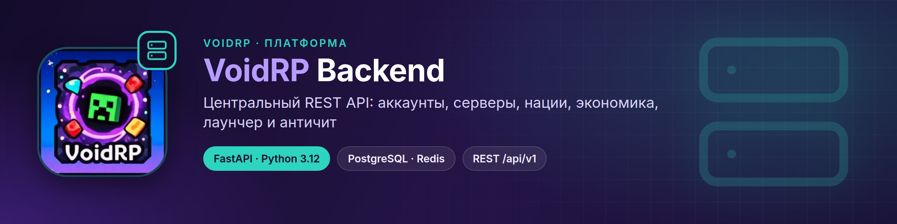
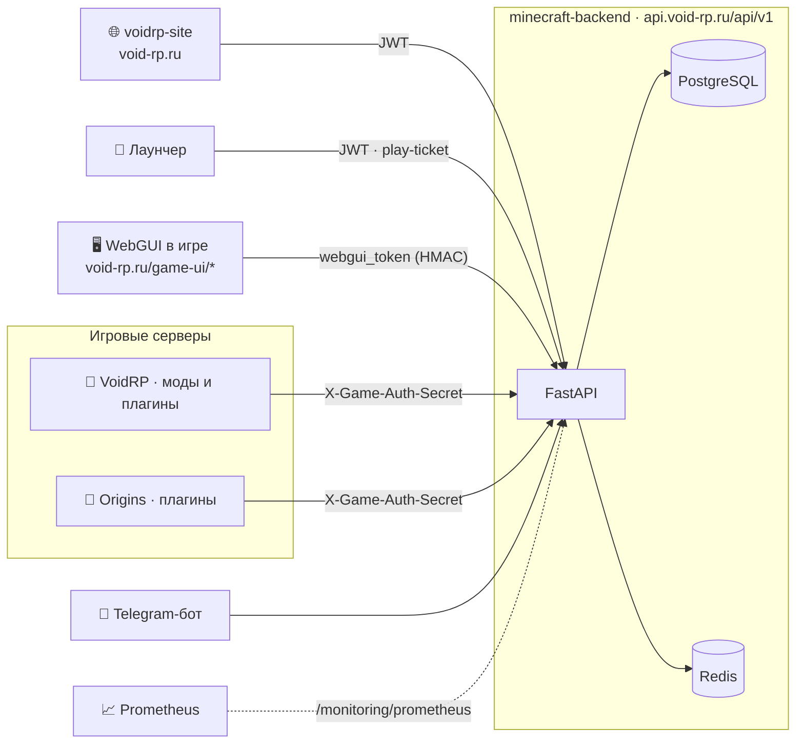
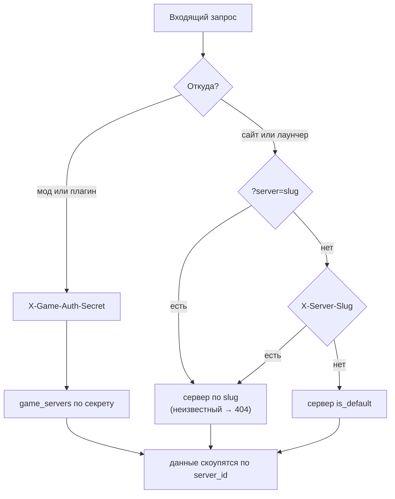
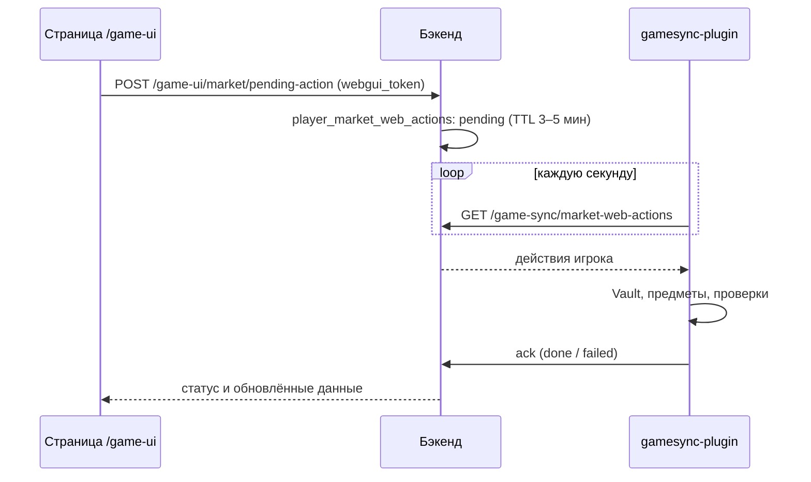

<p align="center"></p>

<div align="center">


[](https://github.com/VOIDRP-MINECRAFT/minecraft-backend/actions/workflows/ci.yml)


</div>

> Центральный REST API платформы VoidRP: аккаунты и согласия, мультисервер, нации и экономика, рынок,
> боевой пропуск, торговец, лаунчер, античит, админ-панель и API для страниц WebGUI внутри игры.

---

## 🗺️ Место в экосистеме



---

## ✨ Возможности

| Область | Что есть | Роутеры |
|---|---|---|
| 🔐 **Аккаунты** | Регистрация, JWT access + opaque refresh, профили, соцсети, рефералы, привязка Telegram | `auth`, `account`, `profiles`, `social`, `referrals`, `profile_telegram` |
| 📜 **Согласия** | Оферта, согласие на ПДн, согласие на распространение; без актуальных документов не выдаётся play-ticket | `consents` |
| 🎫 **Вход в игру** | Play-ticket для модового сервера, вход и регистрация окнами Minecraft на плагинных серверах, скины | `play_ticket`, `server_auth`, `game_auth` |
| 🌍 **Мультисервер** | Каталог серверов, live-пинг, авто-провижининг путей пака, флаги разделов `features` | `servers`, `admin_servers` |
| 🏛️ **Нации** | Нации, альянсы, казна, исследования, сезоны, статистика, проверки территории | `nations`, `alliances`, `nation_stats`, `game_sync_*` |
| 💹 **Экономика** | Динамические цены, рынок игроков и рынок наций, Void Coins, апгрейдер | `economy_market`, `player_market`, `market_public`, `game_sync_void_coins` |
| 🧳 **Торговец** | Расписание визитов, редкие лоты с лимитами, бюджет выплат, сессии у NPC | `trader`, `admin_trader` |
| 🏆 **Прогресс** | Боевой пропуск, еженедельные испытания, гайд и дорожная карта, статистика игроков | `battlepass`, `progression`, `player_stats` |
| 🖥️ **WebGUI** | API для страниц в игре: меню, HUD, рынок, казна, исследования, квесты, пропуск, настройки… | `game_ui_*` |
| 🚀 **Лаунчер** | Дашборд, настройки игры на аккаунте (по серверу), приём крашей и правила краш-советника | `launcher_*`, `admin_launcher*` |
| 🛡️ **Античит** | Нарушения, снимки модов, отчёты об инжектах, вердикты по модам | `game_sync_anticheat`, `admin_anticheat` |
| 🧰 **Админка** | Игроки и наказания, модераторы (RBAC), аудит, донат, новости, уведомления, моды и манифест, мониторинг и RCON | `admin_*` |
| 📣 **Контент** | Новости с автопостингом в Telegram/Discord, RSS, лендинг, TikTok-кампании | `news`, `rss`, `landing`, `tiktok_*` |

---

## 🖥️ Мульти-сервер

Платформа поддерживает несколько игровых серверов при **едином аккаунте**.
`users` / `player_accounts` — глобальные, а все игровые данные (нации, альянсы,
экономика, статистика, play-tickets, battlepass, античит…) скоупятся по
`server_id` → `game_servers`.

- **`game_servers`** (`models/game_server.py`): `slug`, витрина, подключение
  (`host`/`port`/`mc_version`/`loader`/`neoforge_version`), модпак
  (`pack_root`/`manifest_url`/…), доступ (`whitelist_mode`, `maintenance`),
  `features` (JSONB — какие вкладки показывать) и уникальный `game_auth_secret`.
  Ровно один сервер `is_default=True`.
- **Резолв сервера:**
  - плагины/game-sync → `dependencies/server_auth.py` по `X-Game-Auth-Secret`
    (у каждого сервера свой секрет; legacy-секрет → дефолтный сервер);
  - сайт/лаунчер → `dependencies/server_context.py` по `?server=<slug>` →
    заголовку `X-Server-Slug` → дефолтному серверу.
- **Admin:** `routes/admin_servers.py` (`/admin/servers`, CRUD + regenerate-secret
  + загрузка иконок). **Public:** `routes/servers.py` (`/servers`, live-пинг через
  mcstatus с кэшем 30 с).
- **Миграции:** `20260706_0001` (таблица + дефолт-сид) и `20260706_0002`
  (`server_id` в 30 таблиц + свопы уникальных индексов).

---




---

## 🔐 Уровни авторизации

| Слой | Заголовок / параметр | Кто использует |
|---|---|---|
| Пользователь | `Authorization: Bearer <JWT>` | Сайт, лаунчер |
| Администратор | `X-Admin-Api-Secret` или JWT администратора; модераторы — по гранулярным правам | Админ-панель |
| Игровой сервер | `X-Game-Auth-Secret` (у каждого сервера свой) | Моды и плагины |
| WebGUI | `?webgui_token=<HMAC-SHA256>` | Страницы в игре |
| Вход в игру | одноразовый play-ticket | Лаунчер → сервер |

### WebGUI токен

HMAC-SHA256 токен, подписываемый Paper-плагином (`WebGuiBridgeService.signUrl()`):
```text
payload = base64url("1|<playerNickname>|<expiresAtEpoch>")
token   = payload + "." + base64url(HMAC-SHA256(payload, secret))
```

Секрет задаётся в `.env` как `WEBGUI_TOKEN_SECRET_BASE64` (тот же ключ, что в `config/webgui/server.json` мода).

Верификация в `dependencies/webgui_auth.py`:
```python
def get_webgui_player(webgui_token: str = Query(...), ...) -> PlayerAccount:
    # HMAC verify → check expiry → lookup by minecraft_nickname_normalized
```

---

## 📋 Требования

| Компонент | Версия |
|---|---|
| Python | 3.12 |
| PostgreSQL | 15+ |
| Redis | кэш (необязателен для разработки) |

---

## 🚀 Быстрый старт

```bash
python -m venv .venv && source .venv/bin/activate
pip install -e ".[dev]"
cp .env.example .env          # DATABASE_URL, JWT_SECRET_KEY, WEBGUI_TOKEN_SECRET_BASE64 и др.

alembic upgrade head
uvicorn apps.api.app.main:app --reload
```

**Swagger UI:** `http://127.0.0.1:8000/docs`

```bash
alembic revision --autogenerate -m "описание"   # новая миграция
pytest -q                                        # тесты (как в CI)
python -m compileall apps                        # проверка синтаксиса (как в CI)
```

---

## 🏗️ Структура

```
apps/api/app/
├── main.py            create_app(): /api/v1, RSS, Figura
├── config.py          Settings (pydantic-settings, .env)
├── api/routes/        93 модуля роутеров: auth, nations, game_sync_*, game_ui_*, admin_*, launcher_*…
├── dependencies/      auth (JWT) · admin · server_auth (X-Game-Auth-Secret) · server_context (slug) · webgui_auth
├── services/          бизнес-логика: рынок, торговец, пропуск, согласия, play-ticket, краши лаунчера…
├── repositories/      доступ к данным
├── models/ schemas/   SQLAlchemy 2.0 и Pydantic v2
└── core/              безопасность, права, юр. документы, операции с серверами и манифестом, Prometheus
alembic/versions/      миграции
deploy/                nginx, systemd-юнит Telegram-бота, Figura
docs/scripts/          скрипты сервера (вотчдог, бэкапы, манифест лаунчера)
```

---

## 🌐 WebGUI: очередь действий со страниц

Страница в игре не может сама выдать предмет или списать деньги — это делает плагин на сервере.
Поэтому страница кладёт действие в очередь, а `gamesync-plugin` забирает его:



### PlayerMarketWebAction

Таблица `player_market_web_actions` — очередь действий от браузера к плагину:

```python
class PlayerMarketWebAction(Base):
    id: int
    player_nickname: str
    action_type: str        # "buy" | "cancel_sell" | "cancel_buy" | "pickup"
    payload_json: str       # JSON с параметрами
    status: str             # "pending" | "processing" | "done" | "failed"
    expires_at: datetime    # TTL 3-5 минут
    created_at: datetime
```

Плагин (`WebActionPollService`) поллит `GET /game-sync/market-web-actions` каждую секунду и подтверждает через `/ack`.

### `.env` переменные для WebGUI

```env
WEBGUI_TOKEN_SECRET_BASE64=<base64-encoded-32-bytes>
```

Должен совпадать с `tokenSecretBase64` в `config/webgui/server.json` NeoForge мода.

---

## 🔗 Связанные репозитории

| Репо | Связь |
|---|---|
| [voidrp-site](https://github.com/VOIDRP-MINECRAFT/voidrp-site) | Сайт и страницы `/game-ui/*` |
| [voidrp-launcher-vue](https://github.com/VOIDRP-MINECRAFT/voidrp-launcher-vue) | Лаунчер: play-ticket, каталог серверов, краши, настройки игры |
| [voidrp-gamesync-plugin](https://github.com/VOIDRP-MINECRAFT/voidrp-gamesync-plugin) | Главный плагин: `/game-sync/*`, очередь web actions |
| [voidrp-auth-bridge](https://github.com/VOIDRP-MINECRAFT/voidrp-auth-bridge) · [voidrp-auth-plugin](https://github.com/VOIDRP-MINECRAFT/voidrp-auth-plugin) | Вход на модовом и плагинном серверах |
| [voidrp-anticheat](https://github.com/VOIDRP-MINECRAFT/voidrp-anticheat) | Нарушения, снимки модов, отчёты об инжектах |

Полная карта взаимодействий — в [документации организации](https://github.com/VOIDRP-MINECRAFT/.github/blob/main/docs/INTEGRATION.md).

---

<div align="center">
<a href="https://void-rp.ru">🌐 Сайт</a> ·
<a href="https://github.com/VOIDRP-MINECRAFT">🏠 Организация</a> ·
<a href="https://github.com/VOIDRP-MINECRAFT/.github/blob/main/docs/WEBGUI_ARCHITECTURE.md">📐 WebGUI Architecture</a>
</div>
